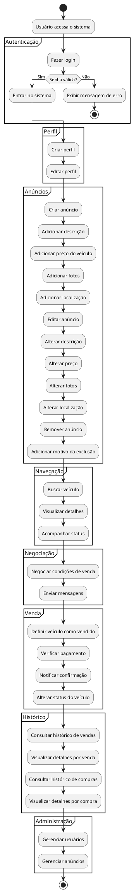

```plantuml
@startuml
start

:Usuário acessa o sistema;
partition Autenticação {
  :Fazer login;
  if (Senha válida?) then (Sim)
    :Entrar no sistema;
  else (Não)
    :Exibir mensagem de erro;
    stop
  endif
}

partition Perfil {
  :Criar perfil;
  :Editar perfil;
}

partition Anúncios {
  :Criar anúncio;
  :Adicionar descrição;
  :Adicionar preço do veículo;
  :Adicionar fotos;
  :Adicionar localização;

  :Editar anúncio;
  :Alterar descrição;
  :Alterar preço;
  :Alterar fotos;
  :Alterar localização;

  :Remover anúncio;
  :Adicionar motivo da exclusão;
}

partition Navegação {
  :Buscar veículo;
  :Visualizar detalhes;
  :Acompanhar status;
}

partition Negociação {
  :Negociar condições de venda;
  :Enviar mensagens;
}

partition Venda {
  :Definir veículo como vendido;
  :Verificar pagamento;
  :Notificar confirmação;
  :Alterar status do veículo;
}

partition Histórico {
  :Consultar histórico de vendas;
  :Visualizar detalhes por venda;

  :Consultar histórico de compras;
  :Visualizar detalhes por compra;
}

partition Administração {
  :Gerenciar usuários;
  :Gerenciar anúncios;
}

stop
@enduml
```