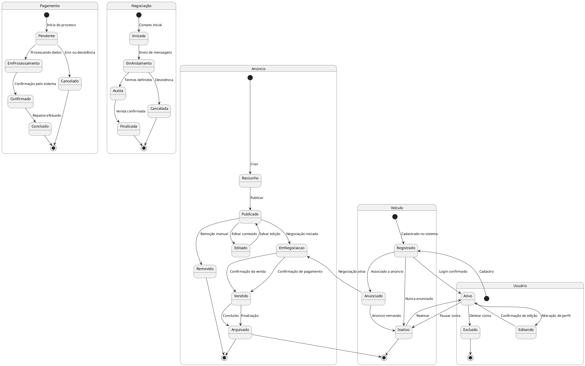

# Diagrama de Transição de Estado

# Grupo

- Guilherme Teodoro de Oliveira RA: 10425362
- Luís Henrique Ribeiro Fernandes RA: 10420079
- Vinícius Brait Lorimier RA: 10420046

```plantuml
@startuml

state "Anúncio" as Anuncio {
  [*] --> Rascunho : Criar
  Rascunho --> Publicado : Publicar
  Publicado --> EmNegociacao : Negociação iniciada
  EmNegociacao --> Vendido : Confirmação de pagamento
  Vendido --> Arquivado : Finalização
  Arquivado --> [*]

  Publicado --> Editado : Editar conteúdo
  Editado --> Publicado : Salvar edição
  Publicado --> Removido : Remoção manual
  Removido --> [*]
}

state "Veículo" as Veiculo {
  [*] --> Registrado : Cadastrado no sistema
  Registrado --> Anunciado : Associado a anúncio
  Anunciado --> EmNegociacao : Negociação ativa
  EmNegociacao --> Vendido : Confirmação da venda
  Vendido --> Arquivado : Concluído
  Arquivado --> [*]

  Registrado --> Inativo : Nunca anunciado
  Inativo --> [*]
  Anunciado --> Inativo : Anúncio removido
}

state "Usuário" as Usuario {
  [*] --> Registrado : Cadastro
  Registrado --> Ativo : Login confirmado
  Ativo --> Editando : Alteração de perfil
  Editando --> Ativo : Confirmação de edição
  Ativo --> Inativo : Pausar conta
  Inativo --> Ativo : Reativar
  Ativo --> Excluido : Deletar conta
  Excluido --> [*]
}

state "Pagamento" as Pagamento {
  [*] --> Pendente : Início do processo
  Pendente --> EmProcessamento : Processando dados
  EmProcessamento --> Confirmado : Confirmação pelo sistema
  Confirmado --> Concluido : Repasse efetuado
  Concluido --> [*]

  Pendente --> Cancelado : Erro ou desistência
  Cancelado --> [*]
}

state "Negociação" as Negociacao {
  [*] --> Iniciada : Contato inicial
  Iniciada --> EmAndamento : Envio de mensagens
  EmAndamento --> Aceita : Termos definidos
  Aceita --> Finalizada : Venda confirmada
  Finalizada --> [*]

  EmAndamento --> Cancelada : Desistência
  Cancelada --> [*]
}
@enduml
```