# Diagramas de Sequência - Sistema de Compra e Venda de Veículos

## Fazer login

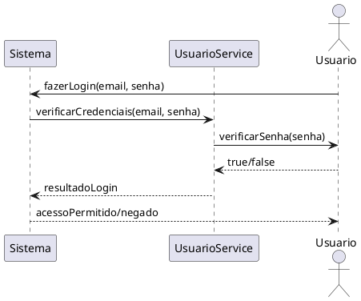

## Editar perfil

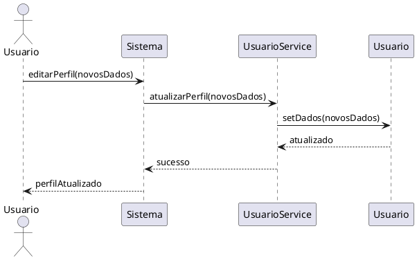

## Criar anúncio

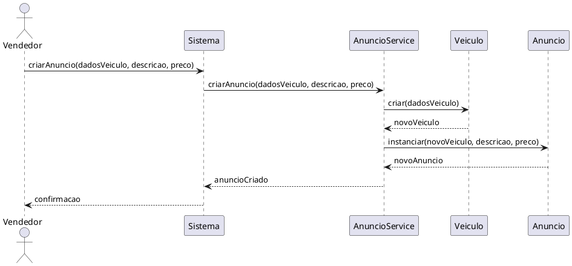

## Editar anúncio

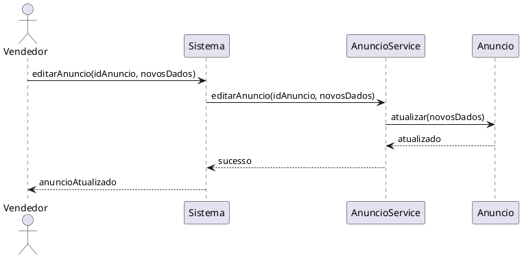

## Remover anúncio

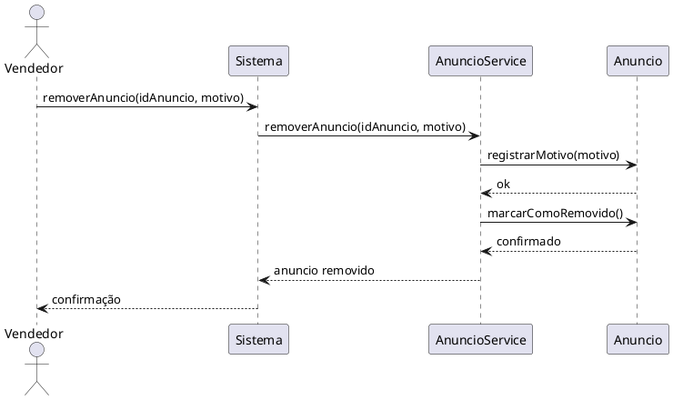

## Buscar veículo

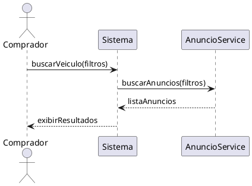

## Verificar senha

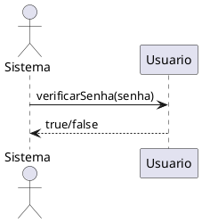

## Exibir mensagem de erro

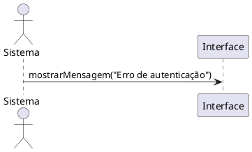

## Adicionar descrição

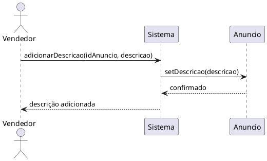

## Adicionar preço do veículo

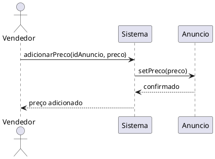

## Alterar descrição

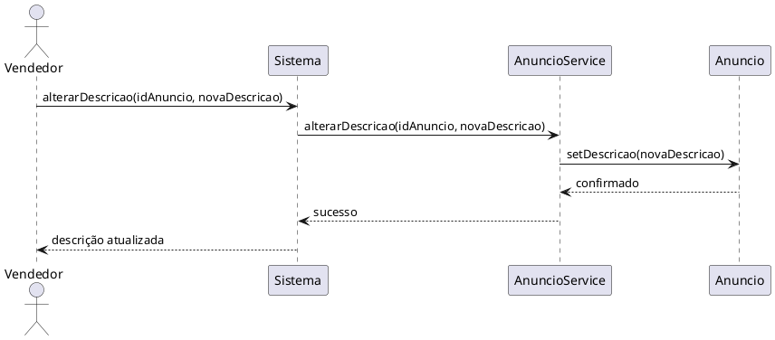

## Alterar preço

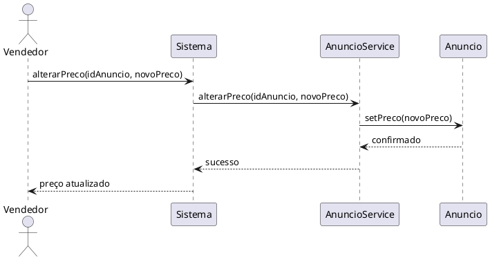

## Adicionar motivo da exclusão

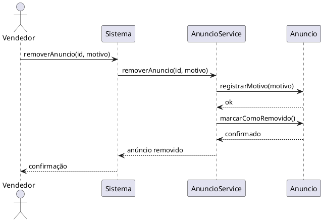

## Visualizar detalhes

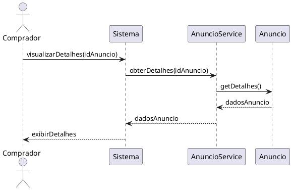

## Acompanhar status

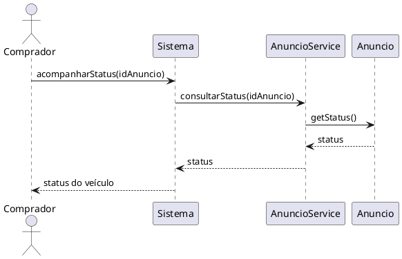

## Criar perfil

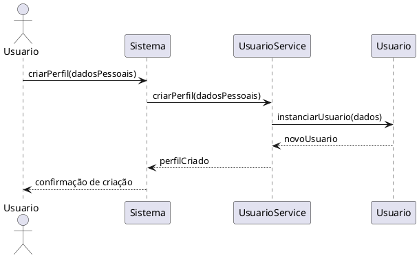

## Adicionar fotos

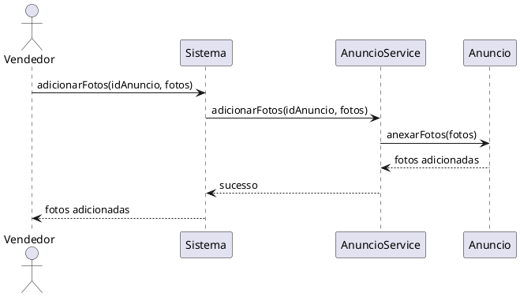

## Adicionar localização

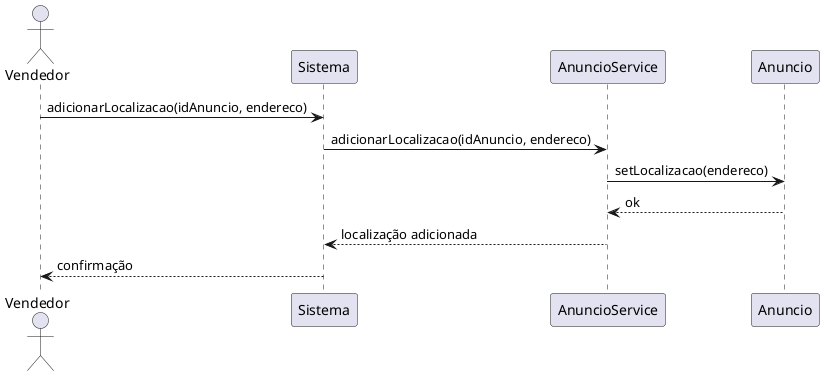

## Alterar fotos

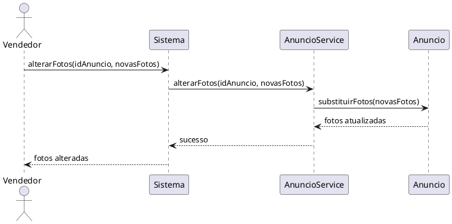

## Alterar localização

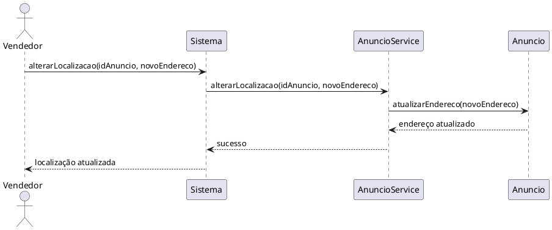

## Excluir perfil

```plantuml
@startuml
actor Usuario
participant "Sistema" as Sistema
participant "UsuarioService" as Service
participant "Usuario" as UsuarioClass

Usuario -> Sistema : excluirPerfil(idUsuario)
Sistema -> Service : excluirPerfil(idUsuario)
Service -> UsuarioClass : marcarComoExcluido()
UsuarioClass --> Service : confirmado
Service --> Sistema : perfil excluído
Sistema --> Usuario : confirmação de exclusão
@enduml
```

