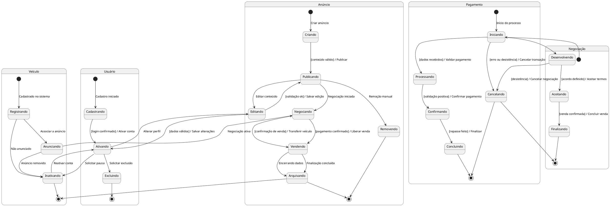

```plantuml
@startuml

state "Anúncio" as Anuncio {
  [*] --> Criando : Criar anúncio
  Criando --> Publicando : [conteúdo válido] / Publicar
  Publicando --> Negociando : Negociação iniciada
  Negociando --> Vendendo : [pagamento confirmado] / Liberar venda
  Vendendo --> Arquivando : Finalização concluída
  Arquivando --> [*]

  Publicando --> Editando : Editar conteúdo
  Editando --> Publicando : [validação ok] / Salvar edição
  Publicando --> Removendo : Remoção manual
  Removendo --> [*]
}

state "Veículo" as Veiculo {
  [*] --> Registrando : Cadastrado no sistema
  Registrando --> Anunciando : Associar a anúncio
  Anunciando --> Negociando : Negociação ativa
  Negociando --> Vendendo : [confirmação de venda] / Transferir veículo
  Vendendo --> Arquivando : Encerrando dados
  Arquivando --> [*]

  Registrando --> Inativando : Não anunciado
  Inativando --> [*]
  Anunciando --> Inativando : Anúncio removido
}

state "Usuário" as Usuario {
  [*] --> Cadastrando : Cadastro iniciado
  Cadastrando --> Ativando : [login confirmado] / Ativar conta
  Ativando --> Editando : Alterar perfil
  Editando --> Ativando : [dados válidos] / Salvar alterações
  Ativando --> Inativando : Solicitar pausa
  Inativando --> Ativando : Reativar conta
  Ativando --> Excluindo : Solicitar exclusão
  Excluindo --> [*]
}

state "Pagamento" as Pagamento {
  [*] --> Iniciando : Início do processo
  Iniciando --> Processando : [dados recebidos] / Validar pagamento
  Processando --> Confirmando : [validação positiva] / Confirmar pagamento
  Confirmando --> Concluindo : [repasse feito] / Finalizar
  Concluindo --> [*]

  Iniciando --> Cancelando : [erro ou desistência] / Cancelar transação
  Cancelando --> [*]
}

state "Negociação" as Negociacao {
  [*] --> Iniciando : Contato inicial
  Iniciando --> Desenvolvendo : Envio de mensagens
  Desenvolvendo --> Aceitando : [acordo definido] / Aceitar termos
  Aceitando --> Finalizando : [venda confirmada] / Concluir venda
  Finalizando --> [*]

  Desenvolvendo --> Cancelando : [desistência] / Cancelar negociação
  Cancelando --> [*]
}

@enduml
```