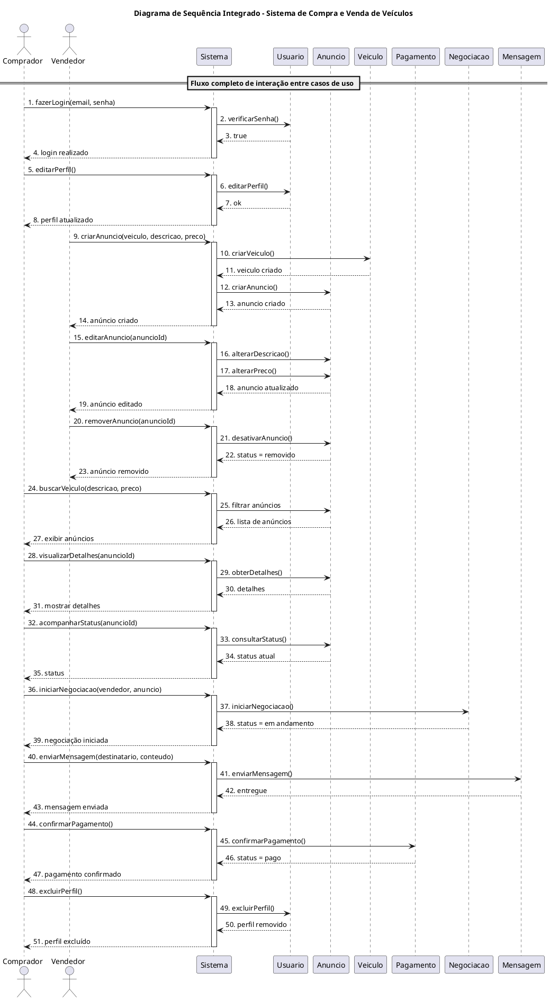

# Diagrama de Sequência Integrado - Sistema de Compra e Venda de Veículos (Mensagens Numeradas)

```plantuml
@startuml
title Diagrama de Sequência Integrado - Sistema de Compra e Venda de Veículos

actor Comprador
actor Vendedor
participant Sistema
participant Usuario
participant Anuncio
participant Veiculo
participant Pagamento
participant Negociacao
participant Mensagem

== Fluxo completo de interação entre casos de uso ==

' Login
Comprador -> Sistema : 1. fazerLogin(email, senha)
activate Sistema
Sistema -> Usuario : 2. verificarSenha()
Usuario --> Sistema : 3. true
Sistema --> Comprador : 4. login realizado
deactivate Sistema

' Editar perfil
Comprador -> Sistema : 5. editarPerfil()
activate Sistema
Sistema -> Usuario : 6. editarPerfil()
Usuario --> Sistema : 7. ok
Sistema --> Comprador : 8. perfil atualizado
deactivate Sistema

' Criar anúncio
Vendedor -> Sistema : 9. criarAnuncio(veiculo, descricao, preco)
activate Sistema
Sistema -> Veiculo : 10. criarVeiculo()
Veiculo --> Sistema : 11. veiculo criado
Sistema -> Anuncio : 12. criarAnuncio()
Anuncio --> Sistema : 13. anuncio criado
Sistema --> Vendedor : 14. anúncio criado
deactivate Sistema

' Editar anúncio
Vendedor -> Sistema : 15. editarAnuncio(anuncioId)
activate Sistema
Sistema -> Anuncio : 16. alterarDescricao()
Sistema -> Anuncio : 17. alterarPreco()
Anuncio --> Sistema : 18. anuncio atualizado
Sistema --> Vendedor : 19. anúncio editado
deactivate Sistema

' Remover anúncio
Vendedor -> Sistema : 20. removerAnuncio(anuncioId)
activate Sistema
Sistema -> Anuncio : 21. desativarAnuncio()
Anuncio --> Sistema : 22. status = removido
Sistema --> Vendedor : 23. anúncio removido
deactivate Sistema

' Buscar veículo
Comprador -> Sistema : 24. buscarVeiculo(descricao, preco)
activate Sistema
Sistema -> Anuncio : 25. filtrar anúncios
Anuncio --> Sistema : 26. lista de anúncios
Sistema --> Comprador : 27. exibir anúncios
deactivate Sistema

' Visualizar detalhes
Comprador -> Sistema : 28. visualizarDetalhes(anuncioId)
activate Sistema
Sistema -> Anuncio : 29. obterDetalhes()
Anuncio --> Sistema : 30. detalhes
Sistema --> Comprador : 31. mostrar detalhes
deactivate Sistema

' Acompanhar status
Comprador -> Sistema : 32. acompanharStatus(anuncioId)
activate Sistema
Sistema -> Anuncio : 33. consultarStatus()
Anuncio --> Sistema : 34. status atual
Sistema --> Comprador : 35. status
deactivate Sistema

' Iniciar negociação
Comprador -> Sistema : 36. iniciarNegociacao(vendedor, anuncio)
activate Sistema
Sistema -> Negociacao : 37. iniciarNegociacao()
Negociacao --> Sistema : 38. status = em andamento
Sistema --> Comprador : 39. negociação iniciada
deactivate Sistema

' Enviar mensagem
Comprador -> Sistema : 40. enviarMensagem(destinatario, conteudo)
activate Sistema
Sistema -> Mensagem : 41. enviarMensagem()
Mensagem --> Sistema : 42. entregue
Sistema --> Comprador : 43. mensagem enviada
deactivate Sistema

' Confirmar pagamento
Comprador -> Sistema : 44. confirmarPagamento()
activate Sistema
Sistema -> Pagamento : 45. confirmarPagamento()
Pagamento --> Sistema : 46. status = pago
Sistema --> Comprador : 47. pagamento confirmado
deactivate Sistema

' Excluir perfil
Comprador -> Sistema : 48. excluirPerfil()
activate Sistema
Sistema -> Usuario : 49. excluirPerfil()
Usuario --> Sistema : 50. perfil removido
Sistema --> Comprador : 51. perfil excluído
deactivate Sistema

@enduml
```