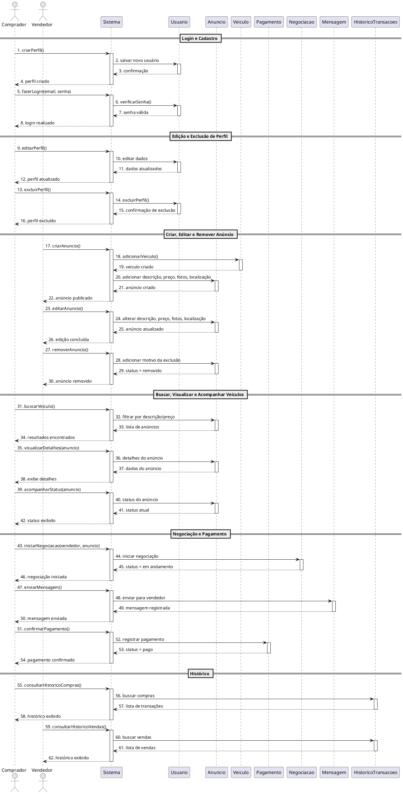

# Diagrama de Sequência Unificado - Todos os Casos de Uso

```plantuml
@startuml

actor Comprador
actor Vendedor
participant Sistema
participant Usuario
participant Anuncio
participant Veiculo
participant Pagamento
participant Negociacao
participant Mensagem
participant HistoricoTransacoes

== Login e Cadastro ==
Comprador -> Sistema : 1. criarPerfil()
activate Sistema
Sistema -> Usuario : 2. salvar novo usuário
activate Usuario
Usuario --> Sistema : 3. confirmação
deactivate Usuario
Sistema --> Comprador : 4. perfil criado
deactivate Sistema

Comprador -> Sistema : 5. fazerLogin(email, senha)
activate Sistema
Sistema -> Usuario : 6. verificarSenha()
activate Usuario
Usuario --> Sistema : 7. senha válida
deactivate Usuario
Sistema --> Comprador : 8. login realizado
deactivate Sistema

== Edição e Exclusão de Perfil ==
Comprador -> Sistema : 9. editarPerfil()
activate Sistema
Sistema -> Usuario : 10. editar dados
activate Usuario
Usuario --> Sistema : 11. dados atualizados
deactivate Usuario
Sistema --> Comprador : 12. perfil atualizado
deactivate Sistema

Comprador -> Sistema : 13. excluirPerfil()
activate Sistema
Sistema -> Usuario : 14. excluirPerfil()
activate Usuario
Usuario --> Sistema : 15. confirmação de exclusão
deactivate Usuario
Sistema --> Comprador : 16. perfil excluído
deactivate Sistema

== Criar, Editar e Remover Anúncio ==
Vendedor -> Sistema : 17. criarAnuncio()
activate Sistema
Sistema -> Veiculo : 18. adicionarVeiculo()
activate Veiculo
Veiculo --> Sistema : 19. veiculo criado
deactivate Veiculo
Sistema -> Anuncio : 20. adicionar descrição, preço, fotos, localização
activate Anuncio
Anuncio --> Sistema : 21. anúncio criado
deactivate Anuncio
Sistema --> Vendedor : 22. anúncio publicado
deactivate Sistema

Vendedor -> Sistema : 23. editarAnuncio()
activate Sistema
Sistema -> Anuncio : 24. alterar descrição, preço, fotos, localização
activate Anuncio
Anuncio --> Sistema : 25. anúncio atualizado
deactivate Anuncio
Sistema --> Vendedor : 26. edição concluída
deactivate Sistema

Vendedor -> Sistema : 27. removerAnuncio()
activate Sistema
Sistema -> Anuncio : 28. adicionar motivo da exclusão
activate Anuncio
Anuncio --> Sistema : 29. status = removido
deactivate Anuncio
Sistema --> Vendedor : 30. anúncio removido
deactivate Sistema

== Buscar, Visualizar e Acompanhar Veículos ==
Comprador -> Sistema : 31. buscarVeiculo()
activate Sistema
Sistema -> Anuncio : 32. filtrar por descrição/preço
activate Anuncio
Anuncio --> Sistema : 33. lista de anúncios
deactivate Anuncio
Sistema --> Comprador : 34. resultados encontrados
deactivate Sistema

Comprador -> Sistema : 35. visualizarDetalhes(anuncio)
activate Sistema
Sistema -> Anuncio : 36. detalhes do anúncio
activate Anuncio
Anuncio --> Sistema : 37. dados do anúncio
deactivate Anuncio
Sistema --> Comprador : 38. exibe detalhes
deactivate Sistema

Comprador -> Sistema : 39. acompanharStatus(anuncio)
activate Sistema
Sistema -> Anuncio : 40. status do anúncio
activate Anuncio
Anuncio --> Sistema : 41. status atual
deactivate Anuncio
Sistema --> Comprador : 42. status exibido
deactivate Sistema

== Negociação e Pagamento ==
Comprador -> Sistema : 43. iniciarNegociacao(vendedor, anuncio)
activate Sistema
Sistema -> Negociacao : 44. iniciar negociação
activate Negociacao
Negociacao --> Sistema : 45. status = em andamento
deactivate Negociacao
Sistema --> Comprador : 46. negociação iniciada
deactivate Sistema

Comprador -> Sistema : 47. enviarMensagem()
activate Sistema
Sistema -> Mensagem : 48. enviar para vendedor
activate Mensagem
Mensagem --> Sistema : 49. mensagem registrada
deactivate Mensagem
Sistema --> Comprador : 50. mensagem enviada
deactivate Sistema

Comprador -> Sistema : 51. confirmarPagamento()
activate Sistema
Sistema -> Pagamento : 52. registrar pagamento
activate Pagamento
Pagamento --> Sistema : 53. status = pago
deactivate Pagamento
Sistema --> Comprador : 54. pagamento confirmado
deactivate Sistema

== Histórico ==
Comprador -> Sistema : 55. consultarHistoricoCompras()
activate Sistema
Sistema -> HistoricoTransacoes : 56. buscar compras
activate HistoricoTransacoes
HistoricoTransacoes --> Sistema : 57. lista de transações
deactivate HistoricoTransacoes
Sistema --> Comprador : 58. histórico exibido
deactivate Sistema

Vendedor -> Sistema : 59. consultarHistoricoVendas()
activate Sistema
Sistema -> HistoricoTransacoes : 60. buscar vendas
activate HistoricoTransacoes
HistoricoTransacoes --> Sistema : 61. lista de vendas
deactivate HistoricoTransacoes
Sistema --> Vendedor : 62. histórico exibido
deactivate Sistema

@enduml
```